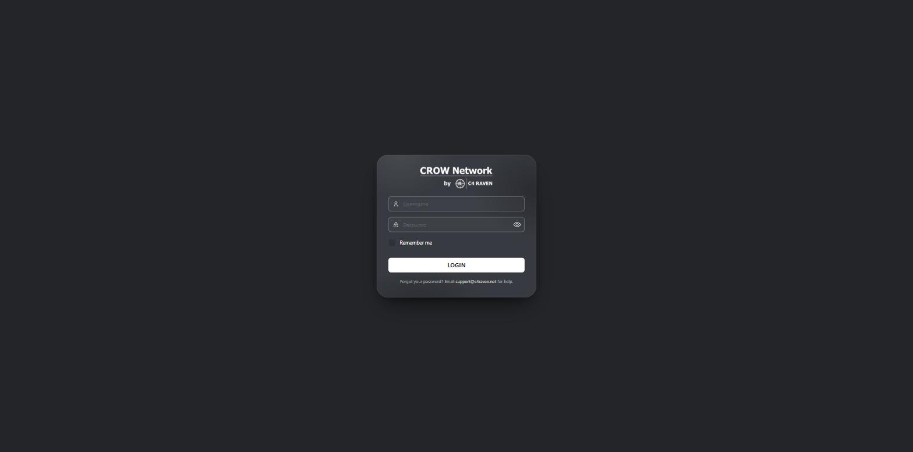
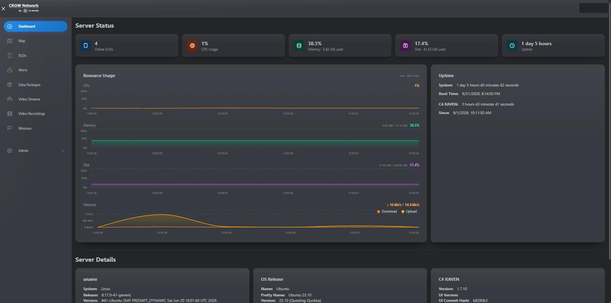
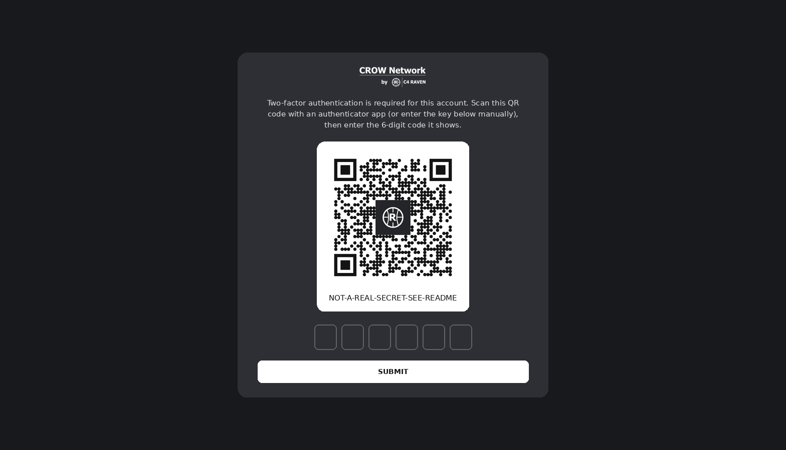
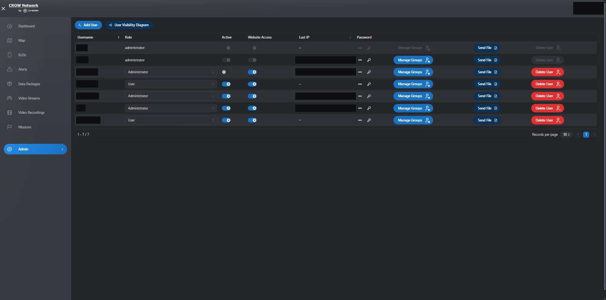
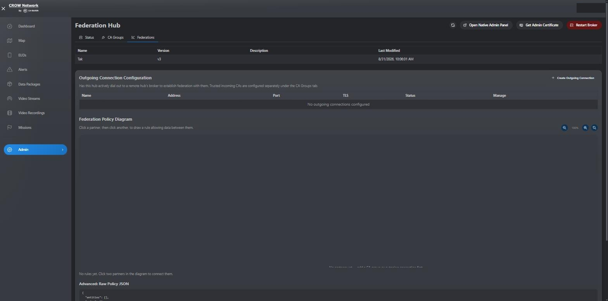

# C4 Raven

<p align="center">
  
</p>

<p align="center">
  <a href="https://tak.c4raven.net"><strong>tak.c4raven.net</strong></a>
</p>

C4 Raven is the web dashboard for our TAK (Team Awareness Kit) server — a
Raven-branded, security-hardened fork of
[OpenTAKServer-UI](https://github.com/brian7704/OpenTAKServer-UI). It gives
operators a live map, device and mission management, video streaming, and
full administrative control over the server, all from the browser.

## What's in it

The dashboard surfaces everything an operator or admin needs at a glance:
server CPU/memory/disk and uptime, connected EUDs (End User Devices), active
alerts, and system details, alongside dedicated pages for the live map, data
packages, video streams and recordings, missions, groups, and Meshtastic
integration.

<p align="center">
  
</p>

On top of the upstream feature set, this fork adds a proper account security
flow that OpenTAKServer-UI doesn't have out of the box. New accounts (and any
account an admin flags) are forced through a real onboarding sequence on
their next login: if two-factor authentication isn't configured yet, the
login page generates a QR code and walks the user through setting it up
inline, and if a password change is required, they're taken straight to
setting a new one before they can do anything else.

<p align="center">
  
</p>

The admin Users page reflects this: instead of an admin having to manually
choose and communicate a new password, there are two one-click actions —
force a user to set a new password on their next login, or issue a
system-generated temporary password for someone who's completely locked out.

<p align="center">
  
</p>

## Federation Hub

A dedicated tab for managing [TAK Server Federation
Hub](https://github.com/C4Raven/federation-hub-setup) — status, trusted CA
groups, and outgoing connections to partner hubs, plus a drag-and-click
policy diagram for drawing data-sharing rules between them, all through a
normal admin login. The backend holds Federation Hub's own admin client
certificate and proxies every call, so nobody needs that certificate
imported into their browser just to check on federation status day to day.

<p align="center">
  
</p>

See [`docs/federation-hub`](docs/federation-hub) for the rest of the
screenshots (status, CA groups, and the 2FA-gated admin certificate download
for the smaller number of cases that still need Federation Hub's own native
console directly).

## Video Streaming

The Video Streams tab lists and plays back whatever's currently publishing
through the server's MediaMTX instance — there's no separate stream key to
issue: an encoder authenticates with a real C4 Raven account over RTMP (or
RTSP/SRT), and the stream shows up automatically. See
[`docs/video-streaming`](docs/video-streaming) for the exact URL format,
which ports need to be open for each protocol, and troubleshooting a
publish that won't connect.

## Stack

React + TypeScript, [Mantine](https://mantine.dev/) for UI components, Vite
for the build. Talks to a [OpenTAKServer](https://www.opentakserver.io/)
backend over its REST API.

## Development

This project uses [Yarn](https://yarnpkg.com/) (via Corepack):

```
corepack yarn install
corepack yarn dev      # start the dev server
corepack yarn build    # production build to dist/
```
