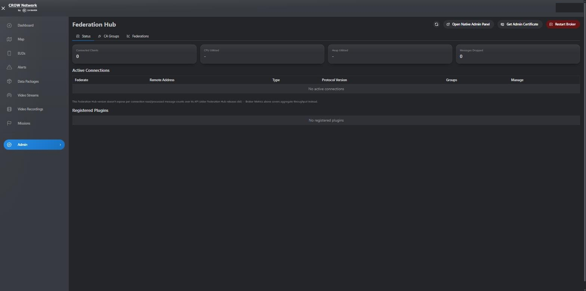
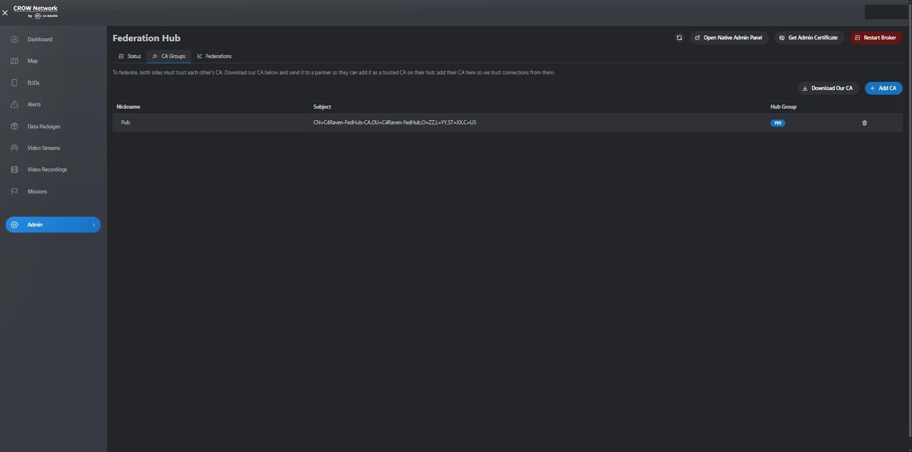
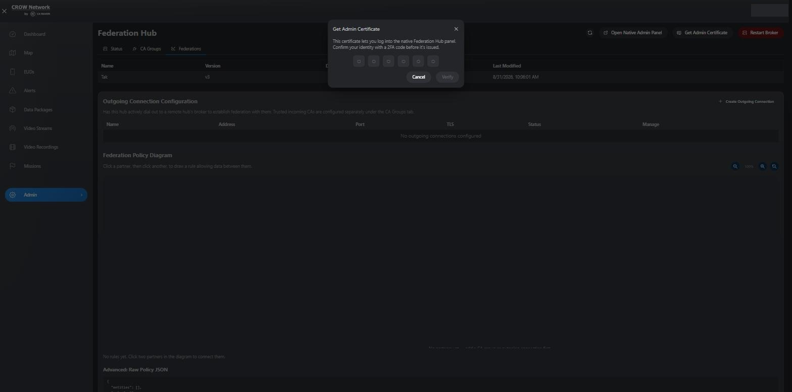

# Federation Hub tab

A Raven-styled admin tab for managing the TAK Server Federation Hub, added so
day-to-day federation management doesn't require the native Federation Hub
admin console's client certificate. All calls are proxied server-side by
`raven` (see `c4raven-server`'s `federation_hub_api.py`) using a dedicated
`fedhub-admin` mTLS client cert the backend holds on the admin's behalf --
browsers never need that cert imported to use this tab.

## Status

Broker metrics, active federation connections, and registered plugins for the
local Federation Hub instance.

## CA Groups

Manage which CAs this hub trusts for inbound federation connections, and
download this hub's own CA to hand to a partner so they can trust us back.

## Federations

Configure outgoing connections to remote hubs, then draw data-sharing rules
between partners directly on a policy graph -- the same drag/click model as
the native Federation Hub admin console's policy editor, rebuilt here so it
doesn't need the client cert either.

## Native admin panel access

The native Federation Hub console (port 9100) still requires its own client
certificate for mTLS login -- a bug in this Federation Hub release's built-in
Keycloak/OAuth support meant that couldn't be replaced with a cert-free login
(confirmed via the actual token exchange and Federation Hub's own JWT
validation code; the token is valid, the app's own filter still rejects it).
Rather than leave that cert to be passed around out-of-band, any Raven admin
can now self-serve it from this tab, gated behind a 2FA check:

